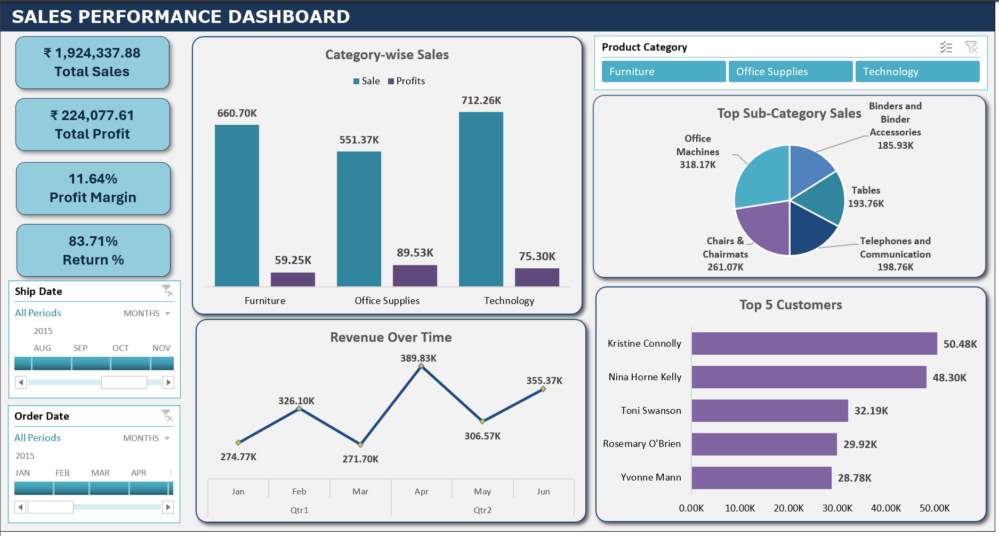
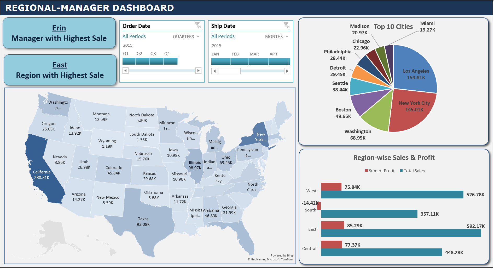
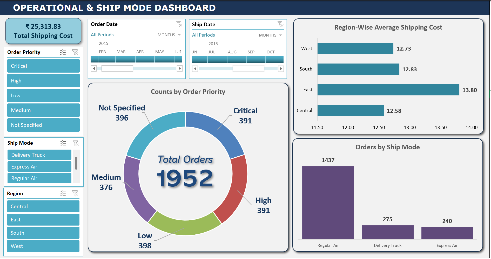

# 📊 USA Retail Superstore Sales Analytics Dashboard

## 🔍 Project Overview
This project analyzes sales, profitability, regional performance, and operational efficiency for a multi-region retail superstore operating across the United States.

The objective was to design role-based dashboards tailored for different business stakeholders:
- Sales Managers
- Regional Heads
- Operations & Supply Chain Teams

The dashboards convert raw transactional data into actionable business insights.

## 🗂 Dataset Description
The dataset represents a retail superstore selling:
- Furniture
- Office Supplies
- Technology products

It includes:
- Order & Ship Dates
- Region, State, City
- Product Category & Sub-Category
- Sales, Profit, Shipping Cost
- Order Priority & Ship Mode

## 📈 Dashboards & Business Use Cases

### 1️⃣ Sales Performance Dashboard
**Business Question:**  
How is the business performing overall and which categories and customers drive revenue and profit?

**Insights Enabled**
- Technology is the highest revenue-generating category
- Profit margins vary significantly across categories
- Revenue shows month-to-month fluctuations
- Top customers contribute a large share of total sales

📷 **Dashboard View**  

**Target Users:** Sales Managers, Business Analysts

### 2️⃣ Regional Manager Dashboard
**Business Question:**  
Which regions, states and cities contribute the most to sales and profit?

**Insights Enabled**
- East region leads in overall sales
- California is the top-performing state
- Los Angeles and New York City generate the highest city-level revenue
- South region shows negative profit despite strong sales volume

📷 **Dashboard View**  

**Target Users:** Regional Managers, Strategy Teams

### 3️⃣ Operational & Ship Mode Dashboard
**Business Question:**  
How efficient are shipping operations and where can costs be optimized?

**Insights Enabled**
- Regular Air is the most frequently used shipping mode
- East region has the highest average shipping cost
- Orders are fairly evenly distributed across priority levels
- Regional shipping cost variations indicate optimization opportunities

📷 **Dashboard View**  

**Target Users:** Operations & Supply Chain Teams

## 🛠 Tools & Skills Used
- Microsoft Excel (Pivot Tables, Pivot Charts, Slicers)
- Data Cleaning & Aggregation
- KPI Design & Business Metrics
- Dashboard Design & Visual Storytelling
- Stakeholder-Oriented Reporting

## 📌 Key Takeaways
- Built role-specific dashboards aligned with real business use cases
- Transformed raw retail data into structured insights
- Balanced high-level KPIs with drill-down analysis
- Designed dashboards with decision-making in mind
- Segment customers by profitability
- Automate data refresh using Power BI or SQL
